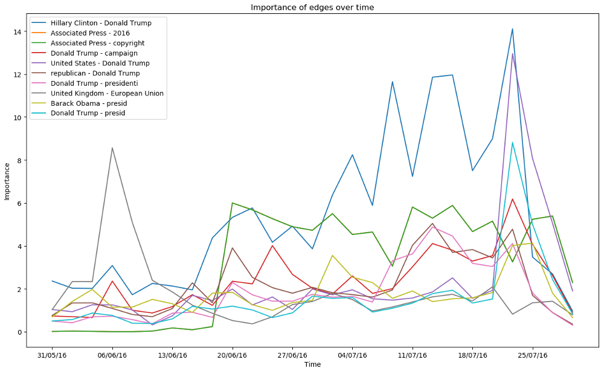
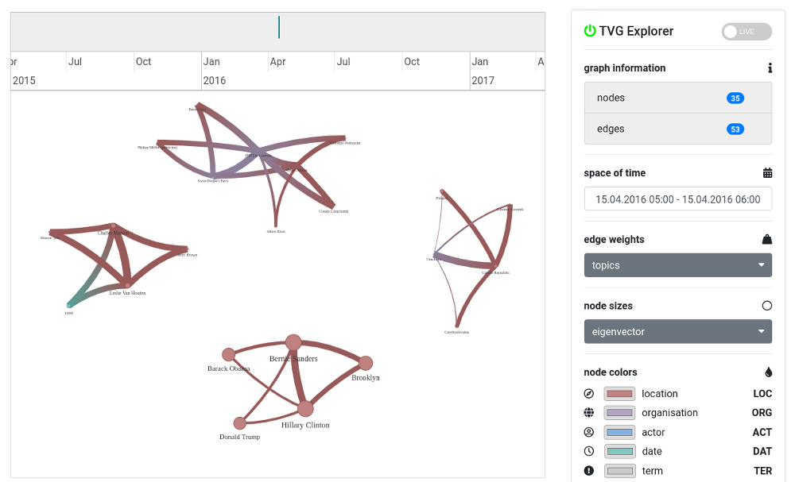

Time-Varying Graph Explorer
===========================

## What is a time-varying graph?

A static graph is defined as `G = (V, E)` where `V` is the set of vertices
and `E` is the set of edges. A time-varying graph is an extension of static
graphs with an additional time dimension added, i.e., either the vertices or
the edges (or both) become functions and can change over time.

See the paper **Time-varying graphs and dynamic networks** by A. Casteigts,
P. Flocchini, W. Quattrociocchi and N. Santoro for a mathematical definition
of time-varying graphs and a survey of various attributes and properties.

In this project we assume that the vertices are fixed, and only the edges can
change over time. Moreover, we assume that we don't have perfect knowledge of
how the network evolves at all times. We only know what the network (or a
subset of the network) looks like at certain points in time.

## Overview

The core component provided by this repository is `libtvg`, a library for
dealing with time-varying graphs. The underlying AVL tree and hash-based data
structure allows efficient operations for loading graphs (either from a file
or from a MongoDB), manipulating graphs (additions, multiplications,
eigenvector computations, ...), aggregating graphs over a specific time frame
(summation or counting of nodes/edges, ...), computing topics (topic model by
A. Spitz et al.), metrics to analyze time-varying graphs (stable nodes/edges,
trend analysis, ...), and much more. This repository also contains Python
bindings (`pytvg`) to use the library directly from Python.



As a sample use-case, this repository provides `TVG Explorer`, a web-based
interactive tool to view and analyze time-varying graphs, as well as sample
scripts to perform certain analysis tasks on the data (see `analysis`
directory).



## Installation

As a first step, please make sure that all required dependencies are installed.
The following commands can be used to install missing build, test and runtime
dependencies on Ubuntu or Debian operating systems:

```bash
# Build dependencies:
sudo apt-get install build-essential
sudo apt-get install wget
sudo apt-get install libmongoc-dev

# Test dependencies:
sudo apt-get install python3-mockupdb
sudo apt-get install clang llvm lcov

# Runtime dependencies:
sudo apt-get install python3
sudo apt-get install python3-numpy
pip3 install SimpleWebSocketServer
```

On macOS, the following commands can be used to install required dependencies:

```bash
# Build dependencies:
xcode-select --install
brew install wget
brew install mongo-c-driver

# Test dependencies:
pip3 install mockupdb

# Runtime dependencies:
brew install python3
pip3 install numpy
pip3 install SimpleWebSocketServer
```

Afterwards, just clone this repository and run (in the root directory of this
repository):

```bash
make
```

Note that this might take quite some time, since this command also downloads
and preprocesses additional datasets. If everything goes well, the program
terminates with exitcode 0. All compiled programs will be located within the
src/ directory.

## Self-Test

This program comes with an extensive set of self-tests to ensure everything
works as expected and to detect regressions during the development process.
To run the tests, just execute:

```bash
make test
```

To run tests for the Python 3 bindings, execute:

```bash
./libtvg/pytvg.py
```

## Documentation

Documentation can be found in the `docs/` directory.

* `docs/pytvg.md` describes how to use API functions provided by `pytvg`.
* `docs/load-tvg.md` describes different ways to load time varying graphs.

## Usage Example

To start a server with the example dataset, run the following command:

```bash
cd explorer
./server.py news_example.conf
```

To run the server with the full dataset, run:

```bash
cd explorer
./server.py news_network_topics.conf
```

It is also possible to stream datasets directly from a MongoDB server, e.g.:

```bash
cd explorer
./server.py news_ambiverse_thabit.conf
```

In each case, open explorer/html/index.html in a web-browser of your
choice to interact with the server.

## References

* A. Casteigts, P. Flocchini, W. Quattrociocchi and N. Santoro. 2012. Time-varying graphs and dynamic networks. IJPEDS, 2012. https://doi.org/10.1080/17445760.2012.668546

* A. Spitz and M. Gertz. 2018. Entity-Centric Topic Extraction and Exploration: A Network-Based Approach. Proceedings of the 40th European Conference on Information Retrieval (ECIR ’18), March 26–29, 2018, Grenoble, France. https://doi.org/10.1007/978-3-319-76941-7_1

* D. Blei and J. Lafferty. 2006. Dynamic topic models. Proceedings of the Twenty-Third International Conference on Machine Learning (ICML 2006), June 25-29, 2006, Pittsburgh, Pennsylvania, USA. https://doi.org/10.1145/1143844.1143859
